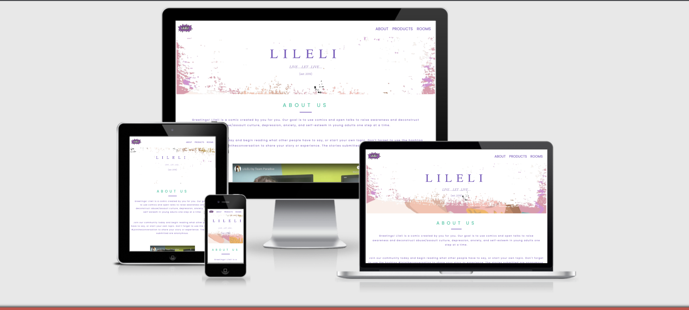

# LILELI

[View Deployed Site](https://didisimmons.github.io/LILELI-QUIZ-GAME/)

### Overview of project: 

LILELI is a website created for a London-based entrepreneur who is dedicated to eradicating the stigma associated with any type of abuse through the use of comics. Its purpose is to inform young adults about abuse that occur in our daily lives. The primary objective of LILELI is to build a community where people can share their stories and meet people who can help them heal.

We provide resources for young adults that are both instructive and understandable. For example, our Comics are simple and pleasant to read; these are actual stories from our community developed exclusively for you, therefore our slogan "comic made by you for you." We hope to solve the ongoing problem in today's society by educating everyone about the harmful consequences of abuse, and we believe that doing so will help to reduce the dangerously high rate of abuse that has been increasing on a daily basis.

A 20-quiz questionnaire has been linked to the website to assess users' awareness of Consent and Sexual Harassment. With the rising number of assault cases in the workplace, homes, friendships, and relationships, it is critical to educate everyone and guarantee that we are all educated and not violating the rights of others.

#### NOTE TO ASSESSOR: 
For security reasons, GitHub has disabled a feature known as the 'interest-cohort' which has affected the quiz game. The deployed website start button on the quiz page is unresponsive. This is further explained in the Bug section of the [Testing](test.md) file. 

## Project Goal 

LILELI is a safe environment dedicated to educating the public about the many types of abuse and their consequences via the use of comic books. We believe that by offering first-hand information on the subject, we can ensure that everyone understands their rights and respects the rights of others.

Our community's experiences would be utilized to make our comics , which would address an ongoing issue in today's culture by training young adults to speak up when they are exploited/harassed/mistreated. This website is aimed towards persons above the age of 18, with the goal of educating them as well as providing a secure space for people to share their stories and learn new things.

The goal of this project is to construct a quiz game that tests the user's knowledge on the topics of Consent and Sexual Harassment, plus a few scenario questions to really put your knowledge to the test. Once finished, the user is given results based on their scores, as well as brief information and links to further educate them on their understandings of consent. We feel that by sharing all of these materials, we are helping to fight sexual abuse of all kinds and making the world a safer place.

### Business Goals
As a business owner I want : 

* Create a visually appealing website that focuses visitors' attention to the battle against harassment.

* To build a website where people may feel comfortable and trust our brand in order to join our community.

* Users should be able to readily comprehend our objective through our comics and meet people from various backgrounds.

* Users may complete the 20-quiz questionnaire on sexual harassment and consent in order to determine the percentage of people who are aware of abuse and to give them links to further educate them on Sexual Abuse and Consent.

### User Goals 

As a customer I want to :

* Easily navigate the site and comprehend the objective of the site in order to take appropriate action if necessary.

* The site should be visually appealing and trustworthy in order to want to join their community and share a story.

* Easily find LILELI online on their social networks to learn more about the brand and confirm its legitimacy and trustworthiness.

* Be able to readily view the questions and learn something new when I take the quiz.

## DESIGN

* Colour Scheme

    -  The colours used in the site's design were developed using the colorspace website. The [spot Pallete](https://mycolor.space/?hex=%23845EC2&sub=1) was chosen.

    - The colours reflect LILELI's brand in order to convey trust and a comfortable space to consumers, as purple represents royalty and has long been connected with abuse victims. To keep the site clean and simple, a white background is also used.
    
* Typography

  - To ensure consistency and to give the site a distinct and friendly image, the typefaces Poppins and Lato are used throughout. The two fonts help to make the site approachable and appealing to our target demographic. There is also a backup font included.

* Imagery 

  - Most of the photos used on the site were obtained from the entrepreneur Teni Fashanu. The logo , hero image, the product images and the images used to create the background picture for certain sections. However some of these images were modified using photoshop for the background images. 

  - The photos utilized depict what to expect from LILELI's comics as well as the safe environment you can expect when you join our community. The photographs are aimed at a certain demographic in order to capture their attention and portray a secure sanctuary.

* Videos 
   
   - The homepage video was made by Henryhousefilms and received from entrepreneur Teni Fashanu.

### Wireframes:  

The wireframe for the entire site can be found [here]( https://www.figma.com/file/jQcJQcFWw9uGwa3Z84LfbX/Lileli?node-id=9%3A260). The webpage flow and interactions can be viewed  [here](https://www.figma.com/proto/jQcJQcFWw9uGwa3Z84LfbX/Lileli?node-id=1%3A2&scaling=min-zoom&page-id=0%3A1&starting-point-node-id=1%3A2) for both a desktop and a mobile device, along with its interactions.

## FEATURES
The page first introduces the user to LILELI by displaying a promotional video and comics in  Abuse. By clicking the “Join Us” button, the user can easily join their community. As the user nears the bottom of the page, they can engage in the quiz challenge by clicking the "take Quiz" button. 

### HOMEPAGE 
The homepage has a fully responsive navigation bar with the logo on the left and three different links (about, products, and rooms) on the right. When a user adjusts the screen to a mobile device, the three different links on the right occupy the centre of the navigation bar, leaving the logo on the far left. 

The hero image is displayed beneath the navigation bar in order to catch the user's attention. The header text and tag line text have a zoom in effect that makes them visually appealing to the user.

The about us section is located beneath the hero image and provides the user with a brief overview of LILELI’s mission. This gives users a small amount of trust in what LILELI is about and how it might be useful for them to stay engaged on the site.

A video has been added under the about section to raise awareness about abuse  and how LILELI can help you. The video's goal is to show abuse victims that they are not alone and that we are all in this together. Under the video content, there is a read more button that allows the user to see more weekly information about LILELI on their blog. This gives the user confidence in the LILELI brand and materials for self-research and education.

The review section is located beneath the video section and displays real-life stories from our community members. These are some of the victims' stories about what they've been through and what you can expect from the lessons in our comics once you buy them. 
A brief compelling text is also included to warm the hearts of the users and demonstrate to them that as a brand, we understand and are here to help, with the goal of gaining their trust. 

This section is followed by a display of comic products. The comics are divided into three major categories, each of which, when clicked, takes the user to a page with a variety of additional comics on specific abuse topics. This displays LILELI's products and informs the user of LILELI's sole purpose. 

We have the quiz container under this section, which is placed directly beneath the product section and contains some enticing text about why you should join LILELI. It also enables the user to complete LILELI's twenty-quiz questionnaire on sexual harassment, abuse, and consent. This enlightens users on the subject, keeping us all informed of the importance of respecting others' rights and comprehending the concept of "consent." The user can also participate in the LILELI conversation on social media by using the hashtag #jointheconversation. The goal of LILELI is for all users to feel a sense of belonging to the LILELI community.

Finally, we have the footer section, which includes LILELI's social media on the left side and a link to their support page and a find out more link on the right side. The social media platforms demonstrate LILELI's legitimacy as a business and foster brand trust.

### START PAGE 

When the user clicks the "Take Quiz" button, the user is taken to the start page. This page includes an image that draws the user's attention to the LILELI quiz. On all devices, the image is centred with a bold text that asks the user to confirm they are over the age of 18 before they can access the quiz. The button controls enable the user to play the game or return to the homepage.

### QUIZ PAGE

The quiz page is launched after the user confirms "YES" from the start page that they are over the age of 18. The page includes two buttons that are stacked on top of each other and display the messages "start" and "instructions." This gives the user instructions on how to play the game, and the start button directs  the user to the questions. A link to the main site has also been included. 

This procedure has been followed to ensure that the correct target audience has been reached and that we are not violating any rights by displaying sensitive content to those of an inappropriate age.

When the game begins, the following features are visible: the question counter and progress bar placed above the question on the left side, and the score field on the right side. The answer options are listed at the bottom of the questions, and the user must select one to proceed to the next question. 

After completing the quiz, the user is given their results as well as links to additional information on Consent & Sexual Harassment. When the user closes the results, they are presented with a "PLAY AGAIN" button, which allows them to reset the game and begin again, with the option of returning to the homepage. 

### EXISTING FEATURES 

* Call to action buttons : This exist on every single page and directs the user to either the homepage, start page or the quiz page to perform their desired function.

* Hero image :  The majority of webpages include an image that draws the user's attention to the site. Its goal is to capture the LILELI experience while also being visually appealing to the user.

* Question Progress Bar:  On the quiz page, there is a question progress bar that can be seen once the user begins the game. This is present on every single page and grows as the user answers each of the questions.

* Score Field : This field is updated whenever the user correctly answers a question. Every time the correct answer is given, the score is increased by 100.

* Questions : There are 20 quiz questions for the user to answer. 

#### FEATURES TO IMPLEMENT IN THE FUTURE 

* When a user clicks "Rooms" in the navigation bar, he or she should be directed to a channel where they can join different topics and discuss with people from all over the world.

* The "Read more" button on the homepage should direct the user to the various types of comics related to the specific topic clicked.

*	Every time the user skips to a new question in the quiz, the option answers should be random. The order of the responses should differ from that of the script.js file.

*  When the user has finished playing the game, a form should be provided in which they can enter their names and phone numbers in order to be contacted.

*	When playing the game, the user should be able to select the number of questions they want to answer. They should be given a group of topics to select from to play the game .

### TECHNOLOGIES USED

### LANGUAGES USED : 
* HTML5
* CSS3 
* Javascript

### FRAMEWORKS,LIBRARIES AND PROGRAM USED 

1. [BOOTSTRAP 4.0](https://getbootstrap.com/docs/4.6/getting-started/introduction/): This was utilized to help with the website's structure, style, and responsiveness for all devices. 

2. [FONTAWESOME](https://fontawesome.com/): This was used to beautify the appearance of the site and convey information through the use of icons. 

3. [GOOGLE FONTS](https://fonts.google.com/specimen/Poppins?query=pop#standard-styles): The fonts Poppins and Lato have been  imported into the stylesheet for use in design of this project.

4. [FIGMA](https://www.figma.com/): This was used to develop the wireframes ( mobile and desktop devices) for LILELI website. 

5. [JSHint](https://jshint.com/): This was used to analyse the JavaScript code , to ensure errors were minimised.

6. [GIT](https://git-scm.com/): This was the preferred method of version control. To commit and publish our project to GitHub, we used the gitpod.

7. [GITHUB](https://github.com/): This is was used to store the projects code.

8. [CHROME DEV TOOLS]() : This was used to test our site's responsiveness across various screen devices and to ensure no errors were found when the website was live and active for the user. 

9. [VISUAL STUDIO CODE](https://code.visualstudio.com/): This was used for writing and testing out the project’s code before committing to GitHub  to avoid internet connection interference.  

10. [FAVICON](https://favicon.io/favicon-converter/): This was used to create the favicon for LILELI. LILELI's favicon is their brand logo, which helps users find their site when they are browsing multiple tabs.

## TESTING 
This can be found in [TESTING.md](test.md) file.

## DEPLOYMENT

This project was deployed using GitHub pages, and the steps required to do so are detailed below. In the event that a user wishes to fork the project, the necessary steps are also provided below.

1. GitHub Pages

      * Log in to GitHub and navigate to the repository to be deployed which is [LILELI QUIZ GAME](https://github.com/Didisimmons/LILELI-QUIZ-GAME).

      *  Once you click the repository, you would see a "settings" option click it and it would direct you to the settings page. 
      
      * Scroll to the bottom of the page , were you see the heading "Github Pages"  click the link "Check it out here." This opens the GitHub Pages tab.
      
      * On the GitHub Pages tab select the "Master" from the dropdown list under "source" and press "save." To ensure the changes are saved the page would be refreshed providing the link of the deployed site. 
      
      * However it is important to note that once the user clicks the deployed site , the user might not be able to view the site immediately, which is not a problem as it might take 2 minutes or less for the deployed site to be active.  

2. Forking The GitHub  Repository

    By forking the GitHub repository, we create a clone of our original repository (LILELI QUIZ GAME) in our GitHub account.This assists modifications and experiments to be done on the cloned repository without affecting the original repository.

      * Sign In to GitHub account . 

      * Decide from the list of repositories which you would want to be duplicated. For this project it's [LILELI QUIZ GAME](https://github.com/Didisimmons/https://github.com/Didisimmons/LILELI-QUIZ-GAME).

      * Locate the "fork" option at the top right corner of the LILELI QUIZ GAME and click it. Once clicked it creates another copy of the LILELI QUIZ GAME repository to accommodate  modifications.

## CREDITS

### CONTENT 

*	 The code for this game was inspired by extensive research on several quiz game tutorials and Stackoverflow articles. Here are the few YouTube channels researched : 
     * [Kindson The Tech Pro](https://www.youtube.com/watch?v=2Bpiluefkh8&t=882s&ab_channel=KindsonTheTechPro). 

     * [Brian Design](https://www.youtube.com/watch?v=f4fB9Xg2JEY&t=3161s&ab_channel=BrianDesign)

     * [Web Dev Simplified](https://www.youtube.com/watch?v=riDzcEQbX6k&t=25s&ab_channel=WebDevSimplified)

     * [Keep Coding](https://www.youtube.com/watch?v=MxrGPP4F8Sc&ab_channel=Keepcoding)

     * [Coding Nepal](https://www.youtube.com/watch?v=pQr4O1OITJo&t=895s&ab_channel=CodingNepal)
 
* The design of the site was inspired by research on various abuse support sites such as [Meetoo](https://metoomvmt.org/), [Everyone's invited](everyonesinvited.uk/) and [Emotional Abuse](http://stoprelationshipabuse.org/educated/types-of-abuse/emotional-abuse/).

*	The animation effect applied to the navigation bar was gotten from [FLYBODY](https://github.com/Didisimmons/Flybody-gym/blob/master/assets/css/style.css) while the effect used on the hero image header and text were gotten from [CSS tricks](https://css-tricks.com/almanac/properties/a/animation/). 

* The box shadow effect on the page's buttons was inspired from Youtuber [Brian Design](https://www.youtube.com/watch?v=f4fB9Xg2JEY&t=3161s&ab_channel=BrianDesign) and modified with CSS.

* The two YouTubers [Brian Design](https://www.youtube.com/watch?v=f4fB9Xg2JEY&t=3161s&ab_channel=BrianDesign) and [Keep Coding](https://www.youtube.com/watch?v=MxrGPP4F8Sc&ab_channel=Keepcoding) provided code assistance for the select Answer function. 

* Code inspiration for the showQuestion function came from [KindsonTheTechPro]( https://www.kindsonthegenius.com/javascript/quiz-application-in-javascript-with-validation-step-by-step/#t4) , another coding institute peer’s [script.js]( https://mervekucukzoroglu.github.io/FikaMed/assets/js/script.js) file and [KeepCoding](https://www.youtube.com/watch?v=MxrGPP4F8Sc&ab_channel=Keepcoding).

* This readme document was based on research on several readme documents, including the Code Institute's readme [sample](https://github.com/Code-Institute-Solutions/SampleREADME), AJ Greaves' readme [sample](https://github.com/AJGreaves/portrait-artist/blob/master/README.md#anna-gilhespy), and FLYBOODY's readME [file ](https://github.com/Didisimmons/Flybody-gym/blob/master/README.md).

* After conducting research, [flaviocopes](https://flaviocopes.com/how-to-shuffle-array-javascript/) provided code assistance for the randomization of the questions.

* The resources used to provide the user with additional information about sexual harassment and consent in the quiz game were obtained from [Sexual Wellbeing](https://www.sexualwellbeing.ie/sexual-health/sexual-consent/sexual-consent-in-practice/), [Rape Crisis](https://rapecrisis.org.uk/get-informed/about-sexual-violence/sexual-consent/) and [IPPF]( https://www.ifpa.ie/sites/default/files/documents/Reports/teaching_about_consent_healthy_boundaries_a_guide_for_educators.pdf). 

### MEDIA

The photographs on the website were primarily obtained from entrepreneur Teni Fashanu, with some of them being examples that have yet to be published. Photoshop was also used to create some of the photos.

* Teni Fashanu provided the LILELI logo, hero picture, product photos, review background image collage and quiz container background image. The review backdrop picture collage and the quiz container background image, on the other hand, were modified to appear as they did on the webpage.

*	David Damz, a graphic designer, made the image on the start page using ProCreate and Photoshop.

*	The LILELI video used on the website was obtained from entrepreneur Teni Fashanu produced by Henryhousefilms.

### ACKNOWLEDGEMENTS

During the planning and execution of this project, the importance of learning by doing was really demonstrated. Consuming all of the material modules initially resulted in a state of confusion and frustration  but starting from somewhere demonstrated that as you progressed, the understanding and logic behind each of the statements becomes clearer, which I am grateful to have experienced.

I'd like to thank Teni Fashanu, an entrepreneur based in London, for allowing me to use her business idea (LILELI comics) for my project. I believe it is critical to educate ourselves on the ongoing issue of different forms of abuse in today's society by teaching young adults to speak up when their rights/rights anyone's have been violated. The quiz game has been linked to this cause in order to educate/survey people's knowledge of Sexual Harassment and Consent in the Workplace, Relationships.

I'd also like to thank the tutor support team for answering all of my inquiries and offering resources that aided in the resolution of any issues that arose.

I'd also want to thank my mentor, Sammy Dartnall, for her ongoing encouragement, help, know-how, and advise during this project.