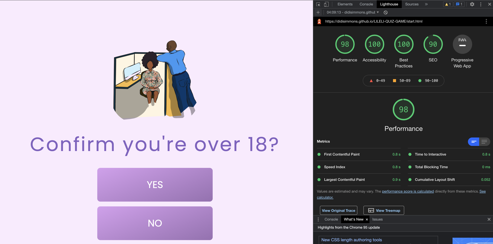
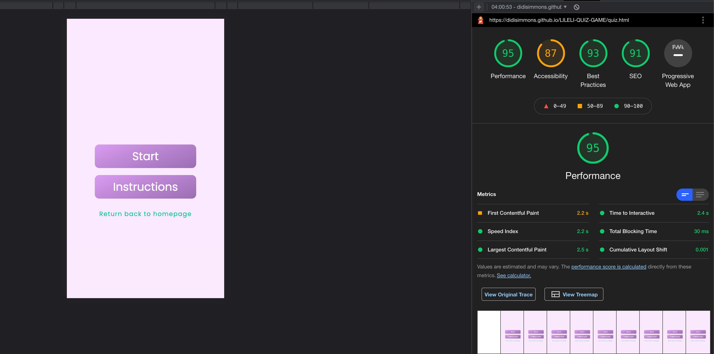

# LILELI 

[View Deployed site](https://didisimmons.github.io/LILELI-QUIZ-GAME/)

[View main README file](readME.md)

## TESTING 

### Validator Testing 
* [W3C Markup Validation](https://validator.w3.org/): This was used to check the validity of the html code for all three webpages. The code was found to be error-free by the validator. See screenshot below for all three pages.

* [W3C CSS validation](https://jigsaw.w3.org/css-validator/): This was used to validate the CSS code used on all three webpages. The code is found to be error-free. See the screenshot below. 

* [JSHint validation ](https://jigsaw.w3.org/https://jshint.com/): This was used to validate the JavaScript code that was used on the quiz page. When this was first run, it was discovered that some semi-colons and defining variables were missing. This was corrected by adding semicolons and defining the variables were needed.

### User stories Testing 

The common path for our user through LILELI website is : 

* ABOUT  > PRODUCTS  > ROOMS > QUIZ 
 
When a user hovers over one of the three different links on the navigation bar and clicks on it, he or she is seamlessly taken to the relevant section of the home page that contains the necessary information. From the homepage, the user can see everything LILELI has to offer, as well as their mission and beliefs. They can easily interact and engage with the site's content. 

The contents are designed to catch the attention of our target audience and pique the user's interest in wanting to participate in and be involved with LILELI. A "take quiz" button has been strategically placed near the bottom of the page to allow the user to gain an understanding of LILELI prior to participating in our quiz.

- As a customer I want to : 

 1. Easily navigate the site and get the information I need to take the necessary.

    *	The home page includes a responsive navigation bar that allows the user to navigate through the various sections on the page to find the relevant information and gain an understanding of LILELI. 

    *	A brief explanation of LILELI's purpose has been provided to give users an idea of what to expect from the site. 

    * 	The user can easily navigate through the page and view real-life stories, join the community, and, if interested, participate in the available quiz. 

    *  The call to action buttons on all pages direct the user to the desired page and inform them of the next steps/action. This improves the overall user experience.

 2. The site should be visually appealing and trustworthy in order to want to join their community and share a story.
     * The site has been kept clean, with appropriate text and more images to convey LILELI's information. The images are specifically in cartoon characters to depict the vision of the upcoming comic books. This gives the user a sense of the LILELI experience. 

     * The background images on the site have been kept clean and concise so that information can be placed on top of them that is appealing to our target demographic.  

    * The user can easily navigate through the page and view real-life stories, join the community, and, if interested, participate in the available quiz. 

    *  A video and a story section have been added to the site to demonstrate LILELI's goal of raising awareness and how the LILELI website is designed to be a safe haven for all. This is because our comic is created by everyone for everyone. 

 3. Easily find LILELI online on their social networks to learn more about the brand and confirm its legitimacy and trustworthiness.
    *  There is a footer section on the homepage that provides the user with links to LILELI's social media platforms. The user can easily visit their pages and conduct additional research on them.  

    * On the right side of the footer, there are two more links that provide the user with additional information about LILELI's works and community. To avoid overloading the user with information on the main page, this links direct the user to another page to view more content .  

4. Be able to readily view the questions and learn something new when I take the quiz.

    *  As the user engages with the page, they can click on any of the call to action buttons to learn more about the specific topic or join the "rooms" to meet new people from all over the world and learn new things. 

    *  The background image of the quiz container draws the user's attention to the quiz button. The quiz can be easily engaged with as the user navigates down the homepage and flows through the webpage content before reaching the footer content.  

    *  When a user clicks the "Take Quiz" button, they are directed to another page to confirm their age before being able to view the 20 scenario-based quiz questionnaire.  

    *  As the user completes the quiz, they are given a score that displays some informative text that may be useful to them. There are also external links to more in-depth content on the subject. 

    

### TESTING ALL FEATURES ON EACH OF THE PAGES 

Chrome dev tools was used to test the responsiveness of each webpage by changing the screen sizes of the device as well as using the console in dev tools to test the quiz game and ensure it is free of bugs and the recurring functions applied actually performed their desired functions without any bugs.

### Homepage 
1. Navigation bar 
    1.	Visit the homepage on a desktop device . 

    2. Confirm that the navigation bar appears with a zoom in effect that appeals to the user as the page is visited.

        When the test is performed by adjusting the screen size to that of a tablet or mobile device, the effect is seen to occur as expected, with no text overflow. This is visually appealing and inviting to the user.

    3. Adjust the desktop screen size to that of a tablet device to ensure the navigation bar is responsive and the menu items adjust to the screen size while remaining on the right side.

         By adjusting the screen size to different breakpoints, it is possible to see that the menu items remain in the specified position to the right. As this screen is reduced to 360px or less on a mobile device, the menu items take up the centre of the navigation bar, with the LILELI's emblem on the left. The menu items and logo adjust to all screen sizes and remain in the intended position. See screenshot below on a mobile device.

        .

    4. Confirm that when the LILELI’s logo is clicked it directs the user to the home page. 

         When this is tested by clicking on the LILELI logo, it is clear that the logo directs the user to the homepage.

    5. Confirm that a white background box shadow appears on the different menu items when you hover over them.
   
        When this is tested, the white box shadow effect can be seen when the mouse is hovered over the links. See screenshot on Ipad Pro.
        
    

2. Hero image  

    1. Visit the homepage on a desktop .  

    2. Check that the hero image is visible and spans the entire width of the screen.

         On a desktop, the hero image fills the entire screen width with no overflow issues. The background image is responsive when the screen width is adjusted for both a tablet and a mobile device.

    3. Check that the hero image text header and accompanying tag line text have an animation effect when the home page loads on all devices, and that the text is legible and appealing.

         The image text header and tagline text are visible on all devices .The font family was changed from "poppins" to "Lato" to improve the visual appearance of the site and entice the user to the site. The stretch animation is applied to both text as expected, adjusting to all screen sizes . However, it was discovered that while the font worked on the local system, it did not respond when published on GitHub. 

        This was rectified by conducting research on similar issues on stack overflow, which yielded a variety of suggestions. The previous code from  Google Fonts [page](https://fonts.google.com/specimen/Poppins?query=pop#standard-styles) has been replaced with the current stylefont link used in the CSS [stylesheet](assets/css/style.css).
        

3.	About Us Section   

    1. On a desktop device, go to the LILELI home page.

    2. Confirm that the text in the about us section responds appropriately to different screen sizes when adjusted.

         When the about us text is tested by adjusting the desktop screen width to a tablet device, it can be seen that it is responsive to the screen width. To appear concise, the font size is adjusted to the different screen widths.
     
4. Video Section 
   
    1. Go to the Home page and scroll to the video. 

    2. Confirm that the video is visible and accessible when the user visits the site. The video should also be able to adapt to all screen sizes. 

         The LILELI promotional video can be viewed as the website loads, with the option to play the video content if desired. As the screen size is changed, it is clear that the video is responsive and maintains its position in the centre while maintaining a clean appearance.

    3. When the user clicks the “read more” button located beneath the check our blog post text, he or she should be directed to a new page.

        When tested on a tablet device, it is clear that when the button is pressed, the desired effect takes place.

    4. Hover over the "Read more" button under the check our blog post and make sure it expands with a box shadow.

         Performing this test reveals that the desired effect occurs, the button expands with a purple box shadow present. When the mouse is hovered over a button, it highlights it for the user capturing the user's curiosity.

5. Review Section 

    1. Go to the Home page and scroll down to the Reviews section, which is located beneath the video content.

    2. Confirm that the three member testimonials are displayed in a slideshow with a previous and back arrow button and carousel indicators present.

        When tested on a desktop device, the slideshow showing the member testimonials is  displayed and their names are anonymous to hide their identity. This is done to build trust with the users so that they know LILELI understand's confidentiality and respects their privacy. The previous and back buttons are visible and are functioning when clicked as well as the carousel indicators which are present under the testimonials. As the screen width is adjusted to that of a tablet device it can be seen that the testimonials and compelling text adjust to the screen size appearing concise and appealing. On a mobile device the same effect takes place, the text adjust responsively to the device.

    3.	Confirm that the “Join Us “ button present under the testimonials section leads the user to a new page when clicked and when hovered the button expands. 

        Testing this on a desktop device it can be seen that the button is present and adjusts accordingly as expected when the screen width is adjusted between a tablet and mobile device, shrinking in size. It can also be noticed that the button expands when the mouse is hovered on it.  
 
    4. Confirm that the background image used for the reviews section is visible and does not affect the visibility of the text and there is no text overflow. 

         When tested on a desktop device, the background image is visible. The previous and back buttons are visible and functional when clicked, as are the carousel indicators located beneath the testimonials. When the screen width is reduced to that of a tablet device, the testimonials and compelling text adjust to the size, appearing concise and appealing as well as the background image. 

6.	Products Section 

    1.	Go to the home page and scroll all the way down to the product section.

    2. Confirm that the comic products are divided into three equal columns with different card container designs. A picture, a title, some engaging text, and a button should all be included in the design of the card container. When the three columns are adjusted, they should be responsive and conform to the screen size. On a mobile device, each card container should take up the entire width of the screen, with one card container per row.

         On a desktop device, the card container with the image, title, and brief introductory text is present, and the container is responsive as it adjusts to different screen sizes. The fonts and buttons are also responsive to the width of the screen. As the screen width is reduced to different breakpoints, the card container collapses from three images per row to one image per row on a mobile device. This is done to ensure that the card container content is visible, appealing and not appearing clustered. 
    
    3.	Hover your mouse over the image of the product card container to see if the alt text appears. 

          When tested on all devices, the alt text appears on the images when the mouse is hovered over them.

    4.	When the "Read More" button is clicked, the user should be directed to another page.

         When tested on a mobile screen width, the button expands when the mouse is hovered over it and, when clicked, directs the user to another page in a new tab to improve user experience.

7. Quiz Section 

    1.	Go to the homepage and scroll all the way down to the quiz section.

    2.	With all elements in place, ensure that the compelling text in the quiz container and the button adjust appropriately on all screen sizes.

         On a desktop device, the quiz content is aligned to the right side of the page, with all of the text visible. As the screen width is reduced below the desktop size, the content shrinks to the desired screen size without compressing the quiz content as expected.

         The "Take Quiz" button on the screen adjusts to the different screen widths, and the font size has the same effect.

    3. Confirm that clicking the "Take Quiz" button takes the user to the start page and that the button expands. 

         When tested on a mobile device, the "Take Quiz" button directs the user to the start page, which opens in a new tab, allowing the user to continue on the homepage if they are still interested.Before the button is clicked as the user hovers, it can be seen that it expands as expected, with a box shadow effect.

    4. Ascertain that the background image used in the "Take Quiz" section does not obstruct the quiz container content and that there is no text overflow.

       On a desktop device, the background image content  is aligned to the left side of the page, while the quiz content and button are aligned to the right.

       The background image content on the left side is cut off when the screen is adjusted to a tablet device, and the background image is just a simple plain light green colour that allows the quiz content text to display. On the background image, there is no text overflow and on a mobile device, the background is kept clean and simple, with only the text and button clearly visible.

8. Footer 

    1.	Go to the Home page and scroll down to the footer.

    2.	Confirm that the social media links on the page all lead to their respective platforms when clicked.

         When tested on a desktop device, it can be seen that when the mouse is hovered over the icons and clicked, the user is directed to a new tab that leads to LILELI's social media accounts, as expected.

    3.	Confirm that the two other links  on the right side of the footer actually take the user to LILELI's webpages.

         Performing this test reveals that the two weblinks actually direct the user to the homepage. However, it does not open a new tab; rather, it refreshes the current page. This was corrected by appending the attribute "target=" blank" to the a element tag. When either of the two links was clicked, the user was directed to a new page.

    4.	To ensure that the footer contents are responsive, expand and contrast the device's screen width. The two web links should appear on top of each other on a mobile device, with the content not looking squashed. 

         As the screen width is reduced to that of a tablet, it can be seen that the footer content is responsive to the screen size, with the font size and icons adjusting as expected without distorting the position of the footer content to maintain its appealing appearance. The two web links appear as expected. 

#### START PAGE

1.	On a desktop device, go to the LILELI home page. Scroll down to the bottom of the page and click the "Take Quiz" button.

2. Confirm that the website displays an image with a bold heading and button controls when the page is loaded.

     When tested, it can be seen that when the "Take Quiz" button is clicked, the user is directed to a new page in a new tab that contains the above-mentioned description.

3. Confirm that the page's content, as well as the image, are centred.

     When the test is run on a desktop device, it is clear that the contents actually occupy the centre of the page. The image is responsive when the screen width is reduced to different breakpoints. It adjusts to different screen sizes without sacrificing quality. Please see the screenshot of former image header below.

    .

4. Check to see if the alt text appears on the image when it is hovered over. 

     When tested, the alt text does not appear when the mouse is hovered over the image, but it is present in the html code when examined. To keep the site consistent, we've decided to keep using cartoon characters to convey information on the homepage.
   
5. Confirm that the two buttons with the labels "yes/No" actually take the user to the correct page when clicked, and that the colour changes when hovered.

    When tested with a desktop screen width, it can be seen that the two different buttons, when hovered over, do indeed change colour as expected. There is a light green box shadow present to alert the user that they are about to select a specific button. 

     When the "Yes" button is pressed, the user is redirected to the quiz game page. When the "No" button is clicked, the user is returned to the homepage to view the contents and interact with other materials on the page.

6.	Adjust the screen width and make sure the button controls are responsive for all devices without looking distorted or unappealing.

     By adjusting the screen width, it is possible to see that the button is responsive to the screen, with its text content in the centre appearing bold. However, the buttons on a mobile device appear very bold and unappealing, so the font size of the buttons, as well as the header text above it, were adjusted for different breakpoints. This change improves the site's visual appeal and eliminates the clustered appearance. Please see the screenshot below of new image header and adjusted buttons.

     .

#### QUIZ PAGE   

1. On a desktop device, go to the LILELI home page. Scroll down to the bottom of the page and click the "Take Quiz" button.

2. This should take you to the start page; if you are over the age of 18, click "YES" to take the sexual harassment and consent quiz. When the user clicks, he or she is taken to the quiz page.

    When this is tested, the wide buttons are visible when the page loads, along with the expected return to home page link. As the width of the screen is reduced to fit a mobile device, the buttons adapt to the size of the screen. As the size decreases, the buttons are centred with no text overflow. A mobile device is depicted in the screenshot.

    .

3. Confirm that when the buttons are clicked, they take the user to the intended page and perform the function they are supposed to.

     When tested it can be seen that when the instruction button is clicked a modal pops up, alerting the user of the rules of the game. There is a “close “ option available at the top right allowing the user to dismiss the message. At the bottom of the message there is a “return home “ button . This button directs the user back to the main site in case they change their mind of not participating in the game again. The buttons are responsive to the screen width adjusting in size.  See screenshot of the instruction pop up modal and the button on a tablet device. 

    .

    When the start button is clicked, the published site's start button does not respond, whereas the local host's start button responds and directs the user to the list of questions. This problem is explained in the bugs section.

 
4. Confirm that the button is highlighted with a box shadow when hovered over.

     When the effect is tested, it is clear that it occurs as expected. A light green shadow appears over the buttons when the mouse is hovered over them. Please see the screenshot below. 

     .

5. Hover over the "return to homepage" link to ensure that it is highlighted and redirects the user to the correct page.

     When hovering the mouse over the "return to homepage" text on a desktop device, the colour changes to purple with a box shadow. This ensures that the links on the homepage are consistent. When the user clicks on the link, he or she is returned to the home page, as intended. Please see the screenshot below.

     .

6. When the start button is pressed, confirm that the questions are displayed as expected.

    - When the start button is clicked, a progress bar, a question counter, and a score field appear above the question field as expected. Please see the screenshot.

     .

    - Under the question and answer options, there is a link to the main site. The link has been kept small to avoid drawing attention to it and to assist the user whenever they want to exit the game.

    -	The same effect occurs when the mouse is hovered over the "return to homepage" link as when the user launches the game. A box shadow appears, and the text colour changes.

    .

    - When the user hovers over one of the four options available, each of the buttons expands.

    - The button goes green when the user selects the correct answer; red when the user selects the incorrect response. When an answer is selected, the system automatically moves on to the following question. Please see the screenshots of the effects explained.

    

    

7. As you play the game, check to see if the score increment function is working properly. The order of the questions differs from the order shown in the script.js file.

    While playing the game, it is possible to notice that the increment function actually works; as the user plays the game and gets the correct answer, the game increments by 1 and the score field is updated. If the user does not correctly answer the question, they are notified. The user is unable to select two options at once and is instead directed to the next question as soon as an answer is selected. The questions are in a random sequence that differs from the pattern in the js source file.

8.	Confirm that the correct results are displayed when the game is completed by clicking the "Play Again" button when the results are dismissed.

    When the user completes the game, a modal appears displaying the user's score range. Different results are displayed to the user based on this score range, with external links at the bottom of the modal to further educate the user about the topic. 

    The modal title text was overflowing from the screen as the screen width was adjusted to lower breakpoints from a desktop device. This was resolved by adjusting the font size of the modal title for various breakpoints. This modification made the modal appear less clustered and more visually appealing. See screenshots below.

     .

     .

    .

    
9.	Check that the "Play again" button and the "return to homepage" link function properly when clicked.

     The "Play Again" button appears as intended after the user closes the results popup. The return to homepage link is also there and functional. Both have the same hover effect as the rest of the links on the page. Please see the image below for a tablet device.
      
      .

10.	When the user clicks the "Play again "button, they should be able to restart the game without any problems. All functions should be operational as expected. 

     After running the test, it is clear that the user is free to restart the game with no problems. Before you click the button, you can see the hover effect. The score field clears when the user restarts the game, and the incremental function works as the user skips from one question to the next, with all questions displayed.

## FURTHER TESTING 

* The site was tested on a desktop device (Mac OS and Windows), iPad, iPhone(6,7,8 and SE) and moto-G4 to ensure that it was error-free and responsive.

* Entrepreneur Teni and colleagues were given access to the site in order for them to provide feedback. One commenter complained that there were too many new links that opened in a new tab. This was corrected by removing the "target =_blank" attribute from the controls on the start page and quiz page buttons. As the user interacted with the start and quiz pages, all links that were clicked in the webpage were directed to the new page in the same page.

* Another criticism was that the homepage header text was not enticing enough. The font family did not properly introduce the webpage. This was corrected by changing the font family of the header text to "Lato." This modification added a more distinct thrill to the website and made it more visually appealing.

* The website [AM I Responsive](http://ami.responsivedesign.is/#) is used to capture LILELI's aesthetic look and responsiveness across all devices. Please see the screenshot below.

    

### LIGHTHOUSE 

The lighthouse test was used to assess the performance, accessibility, best web practices, and SEO of our website. Except for the homepage, the three webpages had high performance scores, which could be attributed to a lack of backup files (images) for varying bandwidths or to caching.
Here are screenshots for the lighthouse test for both desktop and mobile devices for each page: 

## BUGS 
1.	When the site was deployed on GitHub, an error message stating "Error with Permissions-Policy header: Unrecognized feature: 'interest-cohort' " appeared on the console. This error prevented the "start button" on the quiz page from displaying the questions, as seen [here](https://didisimmons.github.io/LILELI-QUIZ-GAME/quiz.html).

     The problem was researched online, and it was discovered that it was beyond my control. The error was caused by GitHub Pages disabling a feature called 'interest-cohort' for security reasons. More information about the problem can be found [here]( https://github.community/t/i-have-no-idea-what-the-interest-cohort-is/179780 ) and in [Web.Dev](https://web.dev/floc/#do-websites-have-to-participate-and-share-information).

2.	On the console tab, you can see another error that occurred when the site was deployed. Please see the screenshot below. 
    
     

However, it should be noted that the errors displayed on the console were inconsistent. The issue was escalated to tutor support, who stated that they couldn't find any errors on the deployed site, but I did notice errors related to a third-party app (Google ads and embedded player) which were from adblocker. The issue was fixed and had no effect on the quiz or the homepage; all functions are fully functional.

 
    